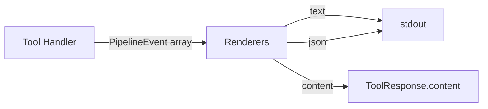
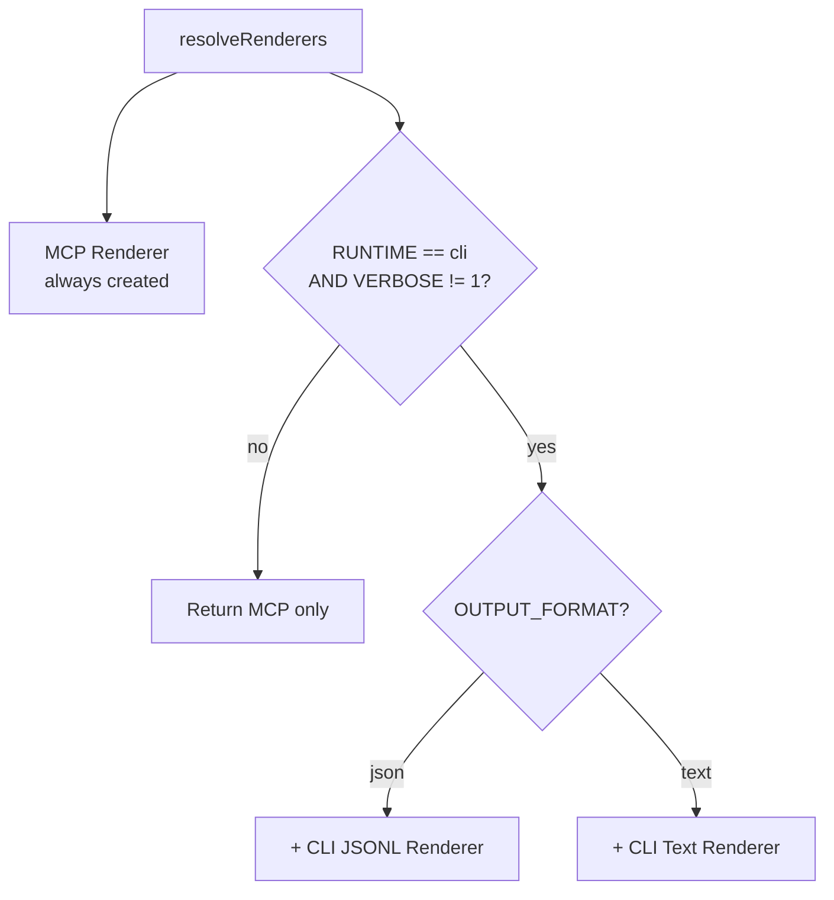
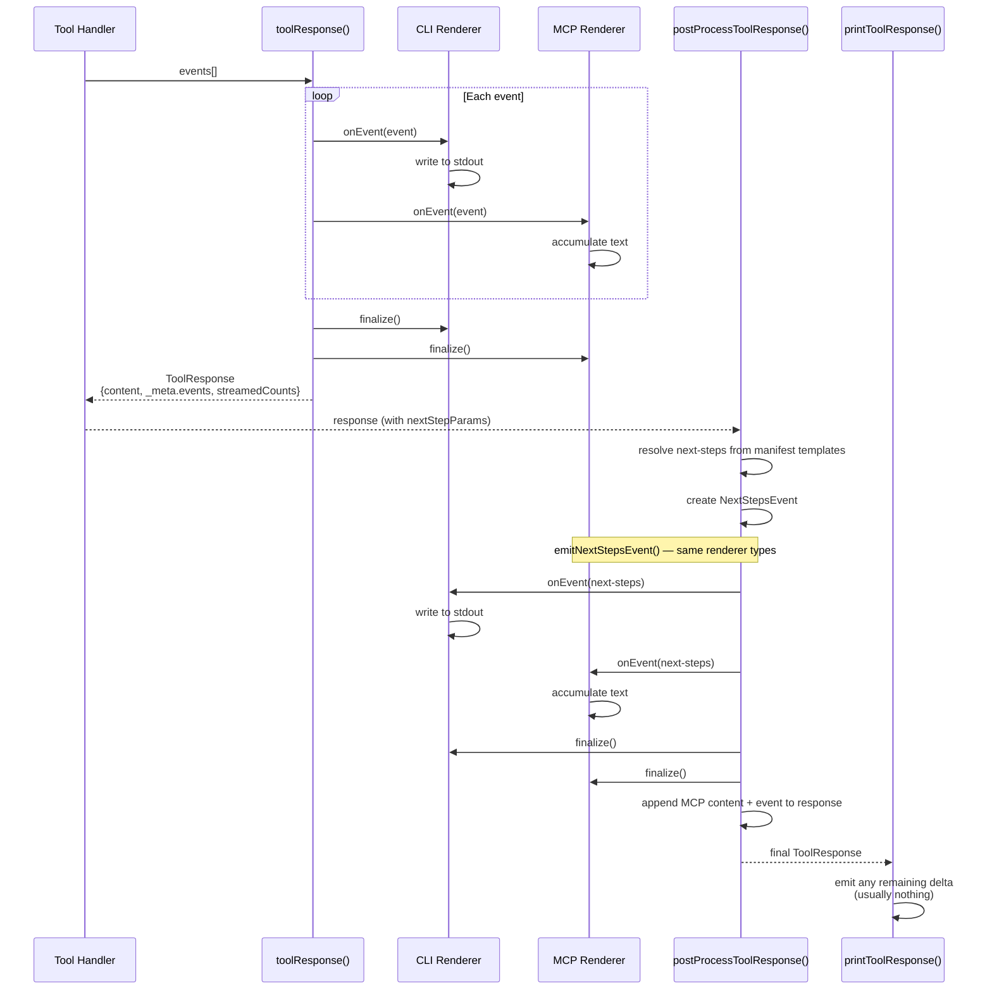
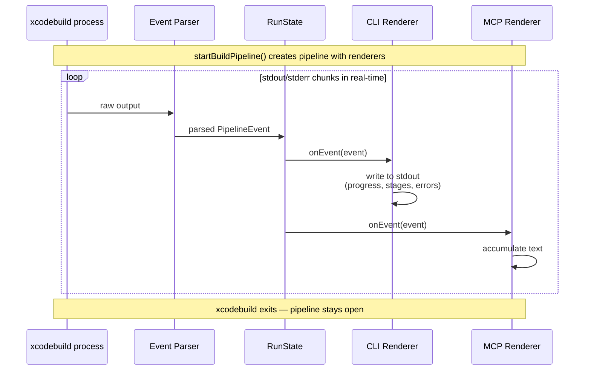
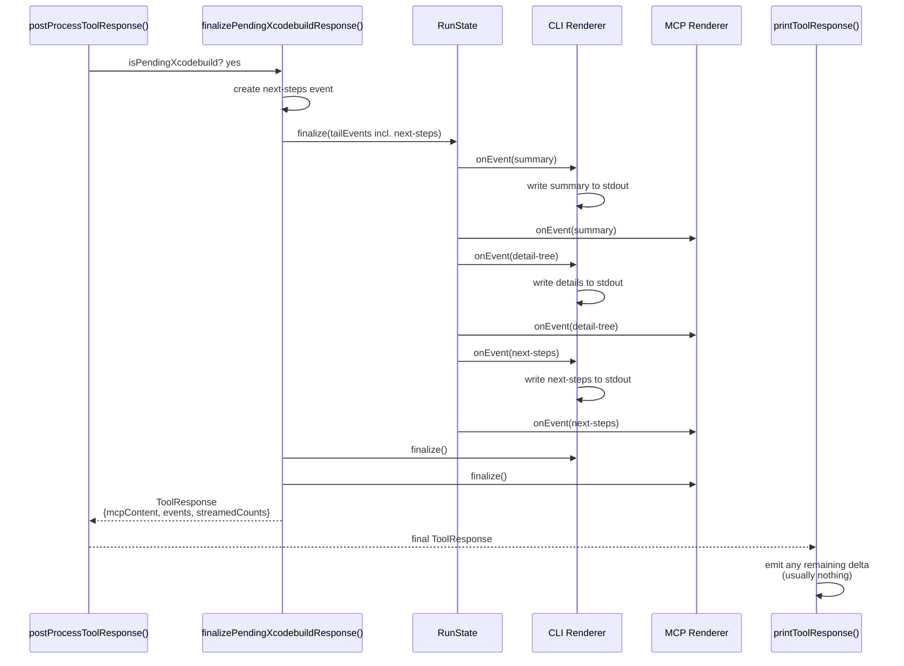
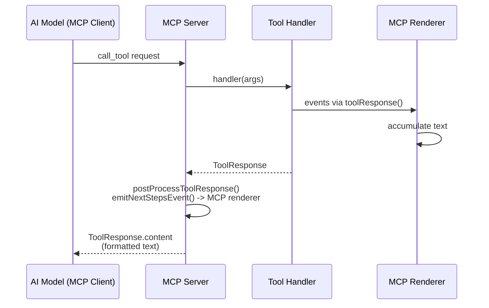
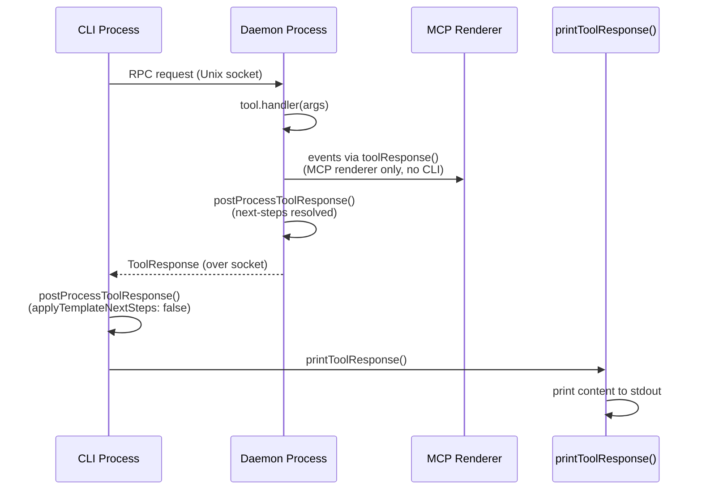
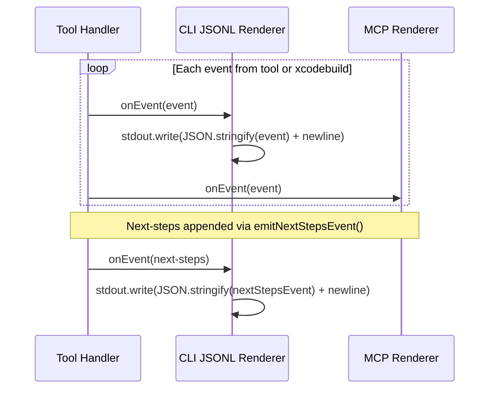

# Rendering Pipeline

All tool output flows through a unified event-based rendering pipeline. Tools produce `PipelineEvent` objects. Renderers consume events and produce output appropriate for the active runtime (CLI text, CLI JSON, MCP).

## Core Principle



Every piece of output — headers, status lines, detail trees, summaries, next-steps — is a pipeline event. Renderers are the **only** mechanism that produces output. There is no direct content mutation, text extraction, or replay.

## Renderers

Three renderers exist. Which are active depends on the runtime environment:

| Renderer | Purpose | Writes to stdout? |
|----------|---------|-------------------|
| **MCP** | Accumulates formatted text into `ToolResponse.content` | No |
| **CLI Text** | Writes formatted, colored text to stdout in real-time | Yes |
| **CLI JSONL** | Writes one JSON object per event per line to stdout | Yes |

### Renderer Activation

Determined by `resolveRenderers()` in `src/utils/renderers/index.ts` based on environment variables set during bootstrap:



| Context | `XCODEBUILDMCP_RUNTIME` | `..._CLI_OUTPUT_FORMAT` | Active Renderers |
|---------|------------------------|------------------------|------------------|
| MCP server | `mcp` | — | MCP only |
| CLI `--output text` | `cli` | `text` | MCP + CLI Text |
| CLI `--output json` | `cli` | `json` | MCP + CLI JSONL |
| Daemon (internal) | `daemon` | — | MCP only |
| Verbose / test | any | any + `VERBOSE=1` | MCP only |

The MCP renderer is **always** active. CLI renderers are additive.

## Pipeline Flows

### Flow 1: Non-Xcodebuild Tools (Immediate)

Most tools (simulator management, project discovery, coverage, UI automation, etc.) produce all their events at once and return immediately. No real-time streaming.



### Flow 2: Xcodebuild Tools (Streaming)

Build, test, and build-and-run tools use a long-lived pipeline that streams events in real-time as xcodebuild produces output. The pipeline stays open during execution and is finalized after the build completes.

#### Build Execution Phase



#### Finalization Phase



Key difference from immediate tools: the pipeline owns the renderer lifecycle. Events stream through renderers during execution. Next-steps are injected as tail events **before** finalization, so they flow through the same renderers in the same pass.

### Flow 3: MCP Server Mode

In MCP mode, only the MCP renderer is active. No CLI output.



Next-steps go through `emitNextStepsEvent()` which creates a fresh MCP renderer, formats the event, and appends the content. The MCP renderer uses function-call format for next-steps (e.g., `install_app_sim({ simulatorId: "..." })`).

### Flow 4: Daemon Mode

Stateful tools run on a background daemon process. The daemon uses MCP-only rendering (no CLI output). The response travels over a Unix socket to the CLI process, which handles CLI output.



### Flow 5: CLI JSON Mode

Events are emitted as JSONL (one JSON object per line) in real-time.



Output example:
```jsonl
{"type":"header","timestamp":"...","operation":"Build","params":[...]}
{"type":"build-stage","timestamp":"...","stage":"COMPILING"}
{"type":"summary","timestamp":"...","status":"SUCCEEDED","durationMs":5200}
{"type":"next-steps","timestamp":"...","steps":[{"tool":"launch_app_sim","params":{...}}]}
```

## Event Types

All events implement `PipelineEvent` (see `src/types/pipeline-events.ts`):

| Event Type | Purpose | Example |
|-----------|---------|---------|
| `header` | Operation banner with params | "Build", scheme, workspace, derived data |
| `build-stage` | Build progress phase | Resolving packages, Compiling, Linking |
| `status-line` | Success/error/warning/info status | "Build succeeded", "App launched" |
| `section` | Titled block with detail lines | Failed test output, captured output |
| `detail-tree` | Key-value tree with branch characters | App path, bundle ID, process ID |
| `table` | Columnar data | Simulator list, device list |
| `file-ref` | File path reference | Build log path, debug log |
| `compiler-error` | Compiler diagnostic | Error message with file location |
| `compiler-warning` | Compiler warning | Warning message with file location |
| `test-failure` | Test failure diagnostic | Test name, assertion, location |
| `test-discovery` | Discovered test list | Test names, count |
| `test-progress` | Running test counts | Completed, failed, total |
| `summary` | Final operation summary | Succeeded/failed, duration, test counts |
| `next-steps` | Suggested follow-up actions | Tool names with params |

## Key Files

| File | Responsibility |
|------|---------------|
| `src/utils/tool-response.ts` | `toolResponse()` — streams events through renderers, returns response |
| `src/utils/renderers/index.ts` | `resolveRenderers()` — decides which renderers are active |
| `src/utils/renderers/mcp-renderer.ts` | Accumulates event text into `ToolResponse.content` |
| `src/utils/renderers/cli-text-renderer.ts` | Writes formatted text to stdout (supports interactive progress) |
| `src/utils/renderers/cli-jsonl-renderer.ts` | Writes JSON events to stdout |
| `src/utils/renderers/event-formatting.ts` | Canonical formatters for each event type |
| `src/utils/xcodebuild-pipeline.ts` | Long-lived pipeline for streaming builds |
| `src/utils/xcodebuild-output.ts` | Pending response creation and finalization |
| `src/utils/xcodebuild-run-state.ts` | Event ordering, deduplication, summary generation |
| `src/runtime/tool-invoker.ts` | Post-processing: next-steps resolution, `emitNextStepsEvent()` |
| `src/cli/output.ts` | `printToolResponse()` — prints remaining delta after renderers |
| `src/utils/tool-event-builders.ts` | Factory functions for creating event objects |

## Design Rules

1. **Events are the model.** All output is represented as `PipelineEvent` objects. Renderers are the only mechanism that turns events into text/JSON.

2. **Renderers produce output.** No direct `process.stdout.write()` outside renderers. No text content mutation after rendering.

3. **One pass per event.** Each event goes through renderers exactly once. No replay, no extraction, no re-rendering.

4. **Next-steps are events.** A `next-steps` event is treated identically to any other event — it flows through renderers which format it according to their strategy.

5. **`printToolResponse()` handles the delta.** After renderers have written streamed output, `printToolResponse()` only prints content items or events that were appended after the initial streaming pass (tracked by `streamedEventCount` / `streamedContentCount`).
